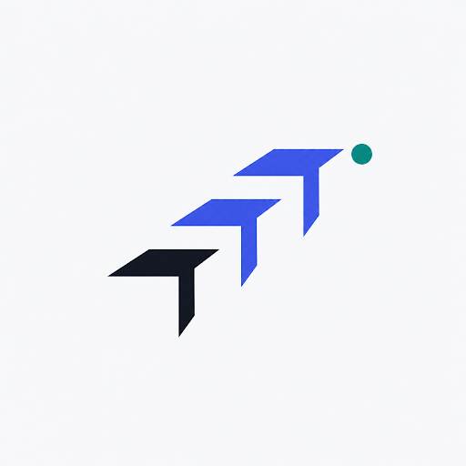
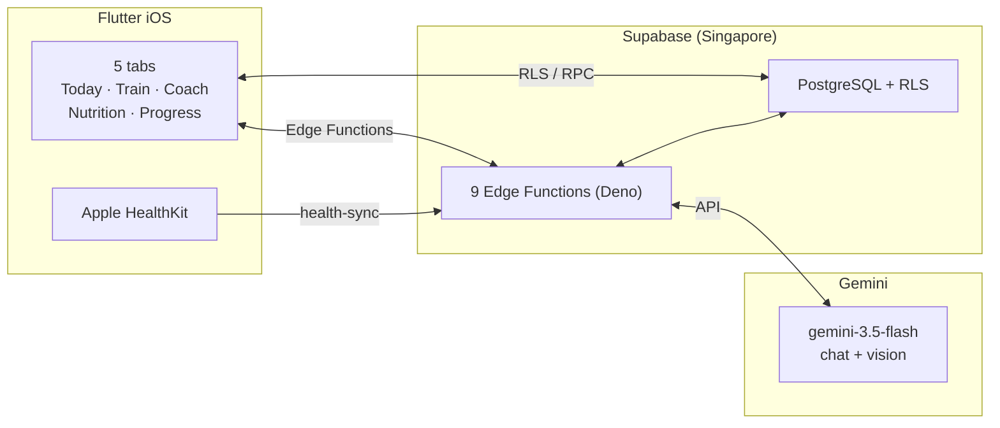

<p align="center">
  
</p>

<h1 align="center">Tracend</h1>

<p align="center">
  <strong>Evidence-driven AI personal trainer</strong><br/>
  <em>Your body. Your data. Your next move.</em>
</p>

<p align="center">
  <a href="https://github.com/PurnaJear06/Tracend/actions/workflows/ci.yml"></a>
  <a href="https://github.com/PurnaJear06/Tracend/actions/workflows/pre-deploy.yml"></a>
  <br/>
  
  
  
  
  
  
</p>

<p align="center">
  <a href="#features">Features</a> &middot;
  <a href="#ai-stack">AI Stack</a> &middot;
  <a href="#architecture">Architecture</a> &middot;
  <a href="#quick-start">Quick Start</a> &middot;
  <a href="#documentation">Docs</a> &middot;
  <a href="#stack">Stack</a>
</p>

---

Tracend gives a healthy adult a personalized training and nutrition plan, observes real execution
and recovery, and produces clear daily coaching decisions — like a careful personal trainer. Plans
stay stable until evidence supports a change, and every persistent change requires your approval.

## Features

### 🏠 Today
Daily readiness dashboard with three tappable factors: **Recovery**, **Training**, and **Nutrition**.
Apple Health surfaces sleep, activity, and vitals with plain-language explanations and progressive
disclosure — no wall of numbers.

### 🏋️ Train
Personalized workout plans with set-level session tracking. Log reps, RPE, and pain. Resume
in-progress sessions after a restart. Apple HealthKit auto-detects completed workouts and
reconciles them with your scheduled plan.

### 🤖 Coach
AI coaching chat that remembers your history across sessions. **Five-layer continuity memory**:
narrative entries, user preferences, session summaries, message search, and context assembly.
Every recommendation cites its evidence source. Reasoning chains shown inline.

### 🥗 Nutrition
Log meals by text or **photo**. AI vision identifies food and estimates macros. Per-meal-slot
schedule compliance tracking with 7-day adherence visibility. Persisted daily logs navigate
backward and forward — confirmed meals stay visible after midnight.

### 📈 Progress
Weight trends, measurement history, and body metrics on a single date-ordered effective timeline.
Raw chart with no smoothing masquerading as current data. Same-day corrections become audited
amendments, never silent overwrites.

### 🔒 Privacy-first AI
- All AI provider keys stay **server-side** in Supabase Edge Functions
- Model output **never** activates a plan, confirms a meal, or writes durable state without explicit approval
- Photos are private, purpose-bound, and accessed only through short-lived authorization
- Every user-owned table has **enabled, tested row-level security (RLS)**
- `beforeSend` scrubber redacts health values, meal content, and photo URLs before ANY crash report leaves the device

## AI Stack

| Layer | Technology | Purpose |
|:------|:-----------|:--------|
| **Coach chat** | Gemini `gemini-3.5-flash` | Evidence-backed coaching responses with reasoning chains (medium thinking) |
| **Meal vision** | Gemini `gemini-3.5-flash` | Macro estimation and food identification from photos (low thinking) |
| **Context assembly** | PostgreSQL + PL/pgSQL | Five-layer structured memory assembled before model inference |
| **Output validation** | Deterministic policy engine | Schema, semantics, evidence citations, and policy permissions — reject on ANY failure |
| **Safety** | `beforeSend` scrubber | Redacts sensitive data before crash reporting reaches Sentry |

> The active model `gemini-3.5-flash` runs with medium thinking for Coach and low thinking for
> meal vision. Groq Qwen `qwen/qwen3.6-27b` was the prior owner-test provider (ADR 0006);
> superseded pending evaluation. Production use requires paid-privacy gate. See
> [`docs/AI_SAFETY_SPEC.md`](docs/AI_SAFETY_SPEC.md).

## Architecture



**9 Edge Functions:** `coach-chat` · `coach-decide` · `health-check` · `health-sync` ·
`meal-analyze` · `meal-media-retention` · `onboarding-propose-plan` · `privacy-delete-account` ·
`privacy-export`

## Quick Start

```sh
git clone https://github.com/PurnaJear06/Tracend.git
cd Tracend

# 1. Install toolchain (one-time)
./scripts/bootstrap-flutter.sh
./scripts/bootstrap-tools.sh

# 2. Run checks
./scripts/flutter.sh analyze         # Dart static analysis
./scripts/flutter.sh test            # Flutter unit + widget tests
./scripts/deno.sh task check         # Deno fmt + lint + test

# 3. Full pre-deploy gate (all layers — matches CI)
./scripts/pre-deploy.sh
```

> All tooling state stays under `.tooling/` on the external SSD. Never invoke `flutter`, `deno`,
> `supabase`, or `docker` directly — use the `./scripts/` wrappers. See
> [`AGENTS.md`](AGENTS.md) for the full toolchain reference.

## Documentation

| Document | Purpose |
|:---------|:--------|
| [`AGENTS.md`](AGENTS.md) | Agent instructions, toolchain reference, architecture rules |
| [`docs/PRD.md`](docs/PRD.md) | Product scope, audience, feature requirements |
| [`docs/ARCHITECTURE.md`](docs/ARCHITECTURE.md) | System design, data flow, component boundaries |
| [`docs/UX_FLOWS.md`](docs/UX_FLOWS.md) | Screen navigation, interaction states, journeys |
| [`docs/DESIGN_SYSTEM.md`](docs/DESIGN_SYSTEM.md) | Visual tokens, component specs, theming rules |
| [`docs/DATA_MODEL.md`](docs/DATA_MODEL.md) | Entity definitions, field schemas, lifecycle rules |
| [`docs/AI_SAFETY_SPEC.md`](docs/AI_SAFETY_SPEC.md) | Model authority, output validation, safety constraints |
| [`docs/SECURITY_PRIVACY.md`](docs/SECURITY_PRIVACY.md) | Data collection, retention, deletion, access control |
| [`docs/TESTING_STRATEGY.md`](docs/TESTING_STRATEGY.md) | Test layers, coverage expectations, quality gates |
| [`docs/IMPLEMENTATION_ROADMAP.md`](docs/IMPLEMENTATION_ROADMAP.md) | Phase sequencing, milestones, delivery plan |
| [`docs/CONTEXT_BUDGET.md`](docs/CONTEXT_BUDGET.md) | AI context budget rules and contract testing |
| [`docs/adr/`](docs/adr/) | Architecture Decision Records |

## Stack

**Client** — Flutter 3.41.7 · Dart 3.11.5 · iOS 17+ · HealthKit · Sentry crash reporting

**Backend** — Supabase · PostgreSQL + RLS · 9 Deno Edge Functions · Session pooler · Storage

**AI** — Gemini 3.5 Flash (chat + vision) · Five-layer continuity memory · Deterministic output
validation · All model keys server-side only

**Infra** — GitHub Actions CI · Pre-deploy gate · Automated database backups · Edge Function
rollback scripts · Colima container runtime · Gitleaks pre-commit · Dependabot

---

<p align="center">
  <em>Tracend is a working brand pending trademark and App Store name clearance.</em>
</p>