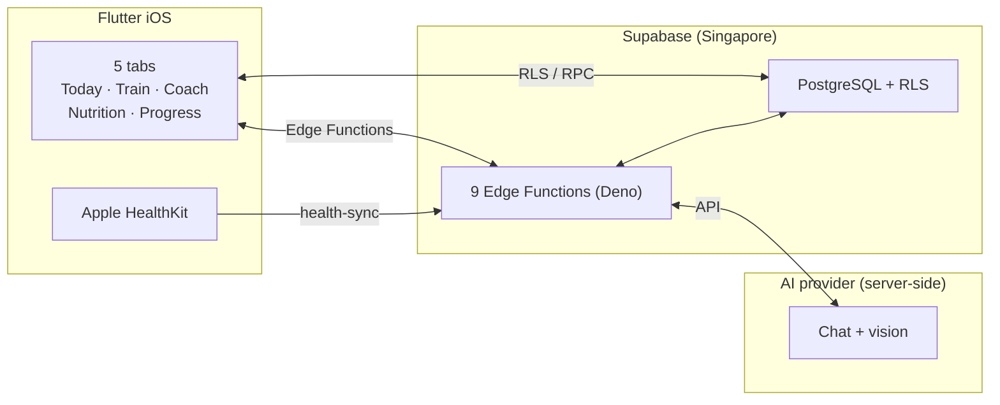

<!-- PROJECT LOGO -->

<p align="center">
  
</p>

<h3 align="center">Tracend</h3>

<p align="center">
  <strong>Evidence-driven AI personal trainer</strong><br/>
  <sub>Your body. Your data. Your next move.</sub>
</p>

<!-- BADGES -->

<p align="center">
  <a href="https://github.com/PurnaJear06/Tracend/actions/workflows/ci.yml"></a>
  <a href="https://github.com/PurnaJear06/Tracend/actions/workflows/deploy.yml"></a>
  <a href="LICENSE"></a>
  
</p>

<!-- NAV -->

<p align="center">
  <a href="#features">Features</a> &middot;
  <a href="#ai-stack">AI</a> &middot;
  <a href="#architecture">Architecture</a> &middot;
  <a href="#quick-start">Quick&nbsp;Start</a> &middot;
  <a href="#documentation">Docs</a> &middot;
  <a href="#license">License</a>
</p>

<p align="center"><sub>Private beta &middot; Apple HealthKit &middot; every model decision requires your approval</sub></p>

---

<p align="center">
  
</p>

Tracend gives a healthy adult a personalized training and nutrition plan, observes real
execution and recovery, and produces clear daily coaching decisions — like a careful
personal trainer. Plans stay stable until evidence supports a change, and every persistent
change requires your approval.

Four rules hold the system together:

- **Deterministic code does the math.** Trends, adherence, and baselines are calculated — never generated. The model interprets; it never computes.
- **Model output never acts on its own.** No plan activation, no confirmed meal, no durable user fact without explicit approval.
- **Persistent change follows an audit trail.** Evidence → validation → approval → new version → audit event.
- **The plan survives failure.** When AI, HealthKit, or media processing is down, your active plan keeps working.

## Features

<p align="center">
  <a href="https://cdn.jsdelivr.net/gh/PurnaJear06/Tracend@main/design/store/screens/train/train.png"></a><a href="https://cdn.jsdelivr.net/gh/PurnaJear06/Tracend@main/design/store/screens/coach/coach.png"></a><a href="https://cdn.jsdelivr.net/gh/PurnaJear06/Tracend@main/design/store/screens/nutrition/nutrition.png"></a><a href="https://cdn.jsdelivr.net/gh/PurnaJear06/Tracend@main/design/store/screens/progress/progress.png"></a>
</p>

### Today — your plan, explained by your data

- Sleep, activity, and vitals from Apple Health become three tappable factors: **Recovery**, **Training**, **Nutrition**
- Plain-language explanations with progressive disclosure — no wall of numbers

### Train — every set counts

- Set-level session tracking: reps, RPE, and pain per set
- In-progress sessions survive an app restart and resume where you left off
- HealthKit auto-detects completed workouts and reconciles them with your scheduled plan

### Coach — every signal connected

- Five-layer continuity memory: narrative entries, user preferences, session summaries, message search, context assembly
- Every recommendation cites its evidence source — reasoning chains shown inline, never hidden

### Nutrition — confirm before it counts

- Log meals by text or photo; vision identifies food and estimates macros — you confirm before anything is persisted
- Per-meal-slot schedule compliance with 7-day adherence visibility
- Confirmed meals stay visible after midnight; corrections become audited amendments

### Progress — proof, not promises

- Weight, measurements, and body metrics on a single date-ordered effective timeline
- Raw charts, no smoothing masquerading as current data; same-day corrections are audited amendments, never silent overwrites

## AI Stack

| Layer                 | Technology                    | Purpose                                                                              |
| :-------------------- | :---------------------------- | :----------------------------------------------------------------------------------- |
| **Coach chat**        | AI, routed server-side        | Evidence-backed coaching responses with reasoning chains                             |
| **Meal vision**       | AI vision, routed server-side | Macro estimation and food identification from photos                                  |
| **Context assembly**  | PostgreSQL + PL/pgSQL          | Five-layer structured memory assembled before inference                               |
| **Output validation** | Deterministic policy engine    | Schema, semantics, evidence citations, policy permissions — reject on ANY failure     |
| **Safety**            | `beforeSend` scrubber         | Redacts health values, meal content, and photo URLs before crash reports leave the device |

> [!NOTE]
> Providers are routed and configured server-side — the app never names, embeds, or depends
> on a specific one. The single source of truth for model boundaries and provider rules is
> [`docs/AI_SAFETY_SPEC.md`](docs/AI_SAFETY_SPEC.md).

## Architecture


```mermaid
flowchart LR
  subgraph Client["Flutter iOS"]
    UI["5 tabs<br/>Today · Train · Coach<br/>Nutrition · Progress"]
    HK["Apple HealthKit"]
  end
  subgraph Supabase["Supabase (Singapore)"]
    DB["PostgreSQL + RLS"]
    EF["9 Edge Functions (Deno)"]
  end
  subgraph AI["AI provider (server-side)"]
    FL["Chat + vision"]
  end
  UI <-->|RLS / RPC| DB
  UI <-->|Edge Functions| EF
  HK -->|health-sync| EF
  EF <-->|API| FL
  EF <--> DB
```

**9 Edge Functions:** `coach-chat` · `coach-decide` · `health-check` · `health-sync` ·
`meal-analyze` · `meal-media-retention` · `onboarding-propose-plan` · `privacy-delete-account` ·
`privacy-export`

## Quick Start

```sh
git clone https://github.com/PurnaJear06/Tracend.git
cd Tracend

# 1. Install toolchain (one-time)
./scripts/bootstrap-flutter.sh
./scripts/bootstrap-tools.sh

# 2. Run checks
./scripts/flutter.sh analyze         # Dart static analysis
./scripts/flutter.sh test            # Flutter unit + widget tests
./scripts/deno.sh task check         # Deno fmt + lint + test

# 3. Full pre-deploy gate (all layers — matches CI)
./scripts/pre-deploy.sh
```

> [!NOTE]
> All tooling state stays under `.tooling/`. Never invoke `flutter`, `deno`, `supabase`, or
> `docker` directly — use the `./scripts/` wrappers. See [`AGENTS.md`](AGENTS.md) for the
> full toolchain reference.

## Documentation

| Document                                                           | Purpose                                                     |
| :----------------------------------------------------------------- | :---------------------------------------------------------- |
| [`AGENTS.md`](AGENTS.md)                                           | Agent instructions, toolchain reference, architecture rules |
| [`docs/PRD.md`](docs/PRD.md)                                       | Product scope, audience, feature requirements               |
| [`docs/ARCHITECTURE.md`](docs/ARCHITECTURE.md)                     | System design, data flow, component boundaries              |
| [`docs/UX_FLOWS.md`](docs/UX_FLOWS.md)                             | Screen navigation, interaction states, journeys             |
| [`docs/DESIGN_SYSTEM.md`](docs/DESIGN_SYSTEM.md)                   | Visual tokens, component specs, theming rules               |
| [`docs/DATA_MODEL.md`](docs/DATA_MODEL.md)                         | Entity definitions, field schemas, lifecycle rules          |
| [`docs/AI_SAFETY_SPEC.md`](docs/AI_SAFETY_SPEC.md)                 | Model boundaries, provider rules, output validation         |
| [`docs/SECURITY_PRIVACY.md`](docs/SECURITY_PRIVACY.md)             | Data collection, retention, deletion, access control        |
| [`docs/TESTING_STRATEGY.md`](docs/TESTING_STRATEGY.md)             | Test layers, coverage expectations, quality gates           |
| [`docs/IMPLEMENTATION_ROADMAP.md`](docs/IMPLEMENTATION_ROADMAP.md) | Phase sequencing, milestones, delivery plan                 |
| [`docs/CONTEXT_BUDGET.md`](docs/CONTEXT_BUDGET.md)                 | AI context budget rules and contract testing                |
| [`docs/adr/`](docs/adr/)                                           | Architecture Decision Records                               |

## Stack

**Client** — Flutter 3.41.7 · Dart 3.11.5 · iOS 17+ · HealthKit · Sentry crash reporting

**Backend** — Supabase · PostgreSQL + RLS · 9 Deno Edge Functions · Session pooler · Storage

**AI** — Server-side provider routing · Five-layer continuity memory · Deterministic output validation · All model keys server-side only

**Infra** — GitHub Actions CI · Automated deploy pipeline · Pre-deploy gate · Automated database backups · Edge Function rollback scripts · Gitleaks pre-commit · Dependabot

## License

Released under the [MIT License](LICENSE).

---

<p align="center">
  <sub>Tracend is a working brand pending trademark and App Store name clearance.</sub>
</p>
