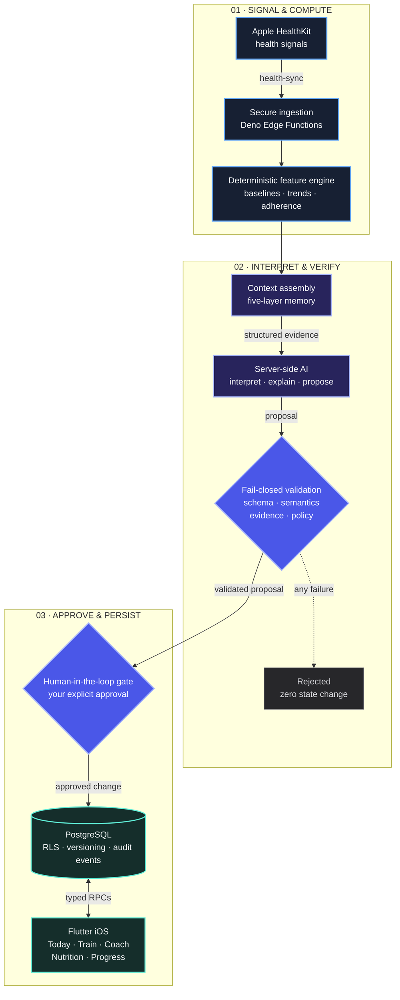

<!-- PROJECT LOGO -->

<p align="center">
  
</p>

<h3 align="center">Tracend</h3>

<p align="center">
  <strong>The evidence-driven AI personal trainer.</strong><br/>
  <sub>Your body. Your data. Your next move.</sub>
</p>

<!-- BADGES -->

<p align="center">
  <a href="https://github.com/PurnaJear06/Tracend/actions/workflows/ci.yml"></a>
  <a href="https://github.com/PurnaJear06/Tracend/actions/workflows/deploy.yml"></a>
  <a href="LICENSE"></a>
  
</p>

<!-- NAV -->

<p align="center">
  <a href="#features"><strong>Features</strong></a> &middot;
  <a href="#how-it-works"><strong>How it works</strong></a> &middot;
  <a href="#architecture"><strong>Architecture</strong></a> &middot;
  <a href="#quick-start"><strong>Quick Start</strong></a> &middot;
  <a href="#documentation"><strong>Docs</strong></a> &middot;
  <a href="#license"><strong>License</strong></a>
</p>

<p align="center"><sub>Private beta &middot; Apple HealthKit &middot; every model decision requires your approval</sub></p>

---

<p align="center">
  
</p>

## Why Tracend

Most fitness apps give you a spreadsheet. Most AI apps give you a chatbot guessing at your body. Tracend is neither.

**Tracend is an evidence-driven AI personal trainer.** It builds a personalized training and nutrition plan around your actual capacity, observes real execution and recovery through Apple Health, and produces clear daily coaching decisions with the reasoning shown inline. Plans stay stable until evidence supports a change, and every persistent change requires your approval.

- **Calculated, never generated.** Trends, adherence, and baselines are computed by deterministic code. The model interprets; it never does the math.
- **Nothing acts on its own.** No plan activation, no confirmed meal, no durable user fact without your explicit approval.
- **Everything is auditable.** Evidence, validation, approval, new version, audit event. Every persistent change follows this chain.
- **The plan survives failure.** When AI, HealthKit, or media processing is down, your active plan keeps working.

> [!NOTE]
> Private beta on a single paired iPhone. Apple HealthKit is the source of truth for all health data. The full model boundary and provider rules live in [`docs/AI_SAFETY_SPEC.md`](docs/AI_SAFETY_SPEC.md).

## Features

### Today

Sleep, activity, and vitals from Apple Health become three tappable factors: **Recovery**, **Training**, and **Nutrition**. Plain-language explanations, progressive disclosure, no wall of numbers. A daily readiness score derived from HRV, resting heart rate, sleep, respiratory rate, and prior strain, with each driver shown as its own metric.

### Train

Set-level session tracking: reps, RPE, and pain per set. In-progress sessions survive an app restart and resume where you left off. HealthKit auto-detects completed workouts and reconciles them with your scheduled plan.

### Coach

Coaching chat that remembers your history across sessions. Five-layer continuity memory: narrative entries, user preferences, session summaries, message search, and context assembly. Every recommendation cites its evidence source, with reasoning chains shown inline.

### Nutrition

Log meals by text or photo. Vision identifies the food and estimates macros. You confirm before anything is persisted. Per-meal-slot schedule compliance with 7-day adherence visibility. Confirmed meals stay visible after midnight; corrections become audited amendments.

### Progress

Weight, measurements, and body metrics on a single date-ordered effective timeline. Raw charts, no smoothing masquerading as current data. Same-day corrections are audited amendments, never silent overwrites.

## How it works

### The AI never touches the numbers

Tracend uses AI where judgment helps — never where correctness demands deterministic math. A dedicated feature engine computes every trend, adherence measure, and personal baseline from your health and training data. The model receives structured context, interprets the evidence, and returns a proposal. It never calculates source metrics or writes directly to the database.

Every proposal passes fail-closed schema, semantic, evidence-citation, and policy checks. A validated proposal can become a persistent change only after your explicit approval, creating a new version and an audit event.

> **AI proposes. Code verifies. You decide. Every change is auditable.**


```mermaid
flowchart TB
  subgraph SIGNAL["01 · SIGNAL & COMPUTE"]
    direction LR
    HK["Apple HealthKit<br/>health signals"]
    EDGE["Secure ingestion<br/>Deno Edge Functions"]
    ENGINE["Deterministic feature engine<br/>baselines · trends · adherence"]
    HK -->|health-sync| EDGE --> ENGINE
  end

  subgraph INTELLIGENCE["02 · INTERPRET & VERIFY"]
    direction LR
    CONTEXT["Context assembly<br/>five-layer memory"]
    MODEL["Server-side AI<br/>interpret · explain · propose"]
    VALIDATE{"Fail-closed validation<br/>schema · semantics<br/>evidence · policy"}
    BLOCK["Rejected<br/>zero state change"]
    CONTEXT -->|structured evidence| MODEL -->|proposal| VALIDATE
    VALIDATE -.->|any failure| BLOCK
  end

  subgraph CONTROL["03 · APPROVE & PERSIST"]
    direction LR
    APPROVAL{"Human-in-the-loop gate<br/>your explicit approval"}
    DB[("PostgreSQL<br/>RLS · versioning · audit events")]
    APP["Flutter iOS<br/>Today · Train · Coach<br/>Nutrition · Progress"]
    APPROVAL -->|approved change| DB <-->|typed RPCs| APP
  end

  ENGINE --> CONTEXT
  VALIDATE -->|validated proposal| APPROVAL

  classDef compute fill:#172033,stroke:#60A5FA,color:#F8FAFC,stroke-width:2px
  classDef intelligence fill:#28245C,stroke:#A5B4FC,color:#F8FAFC,stroke-width:2px
  classDef gate fill:#4A57E8,stroke:#A5B4FC,color:#FFFFFF,stroke-width:2px
  classDef storage fill:#152E2B,stroke:#5EEAD4,color:#F8FAFC,stroke-width:2px
  classDef rejected fill:#27272A,stroke:#71717A,color:#D4D4D8
  class HK,EDGE,ENGINE compute
  class CONTEXT,MODEL intelligence
  class VALIDATE,APPROVAL gate
  class DB,APP storage
  class BLOCK rejected
```

## Architecture

Flutter iOS client. Supabase backend: PostgreSQL with row-level security, 9 Deno Edge Functions, Storage, and automated backups. AI providers are routed server-side only, so the app never names, embeds, or depends on a specific one. The single source of truth for model boundaries and provider rules is [`docs/AI_SAFETY_SPEC.md`](docs/AI_SAFETY_SPEC.md).

**9 Edge Functions:** `coach-chat` · `coach-decide` · `health-check` · `health-sync` · `meal-analyze` · `meal-media-retention` · `onboarding-propose-plan` · `privacy-delete-account` · `privacy-export`

## Quick Start

```sh
git clone https://github.com/PurnaJear06/Tracend.git
cd Tracend

# 1. Install toolchain (one-time)
./scripts/bootstrap-flutter.sh
./scripts/bootstrap-tools.sh

# 2. Run checks
./scripts/flutter.sh analyze         # Dart static analysis
./scripts/flutter.sh test            # Flutter unit + widget tests
./scripts/deno.sh task check         # Deno fmt + lint + test

# 3. Full pre-deploy gate (all layers - matches CI)
./scripts/pre-deploy.sh
```

> [!NOTE]
> All tooling state stays under `.tooling/`. Never invoke `flutter`, `deno`, `supabase`, or
> `docker` directly: use the `./scripts/` wrappers. See [`AGENTS.md`](AGENTS.md)
> for the full toolchain reference.

## Documentation

| Document                                                           | Purpose                                                     |
| :----------------------------------------------------------------- | :---------------------------------------------------------- |
| [`AGENTS.md`](AGENTS.md)                                           | Agent instructions, toolchain reference, architecture rules |
| [`docs/PRD.md`](docs/PRD.md)                                       | Product scope, audience, feature requirements               |
| [`docs/ARCHITECTURE.md`](docs/ARCHITECTURE.md)                     | System design, data flow, component boundaries              |
| [`docs/UX_FLOWS.md`](docs/UX_FLOWS.md)                             | Screen navigation, interaction states, journeys             |
| [`docs/DESIGN_SYSTEM.md`](docs/DESIGN_SYSTEM.md)                   | Visual tokens, component specs, theming rules               |
| [`docs/DATA_MODEL.md`](docs/DATA_MODEL.md)                         | Entity definitions, field schemas, lifecycle rules          |
| [`docs/AI_SAFETY_SPEC.md`](docs/AI_SAFETY_SPEC.md)                 | Model boundaries, provider rules, output validation         |
| [`docs/SECURITY_PRIVACY.md`](docs/SECURITY_PRIVACY.md)             | Data collection, retention, deletion, access control        |
| [`docs/TESTING_STRATEGY.md`](docs/TESTING_STRATEGY.md)             | Test layers, coverage expectations, quality gates           |
| [`docs/IMPLEMENTATION_ROADMAP.md`](docs/IMPLEMENTATION_ROADMAP.md) | Phase sequencing, milestones, delivery plan                 |
| [`docs/CONTEXT_BUDGET.md`](docs/CONTEXT_BUDGET.md)                 | AI context budget rules and contract testing                |
| [`docs/adr/`](docs/adr/)                                           | Architecture Decision Records                               |

## License

Released under the [MIT License](LICENSE).

---

<p align="center">
  <sub>Tracend is a working brand pending trademark and App Store name clearance.</sub>
</p>
