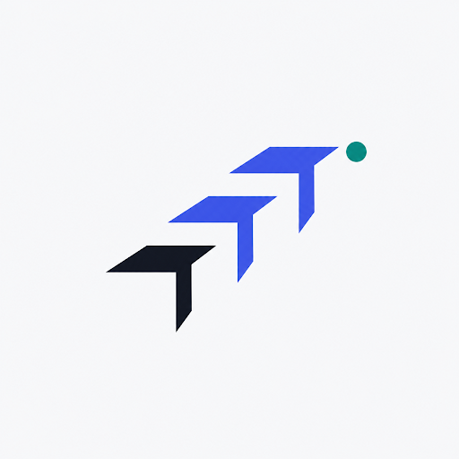
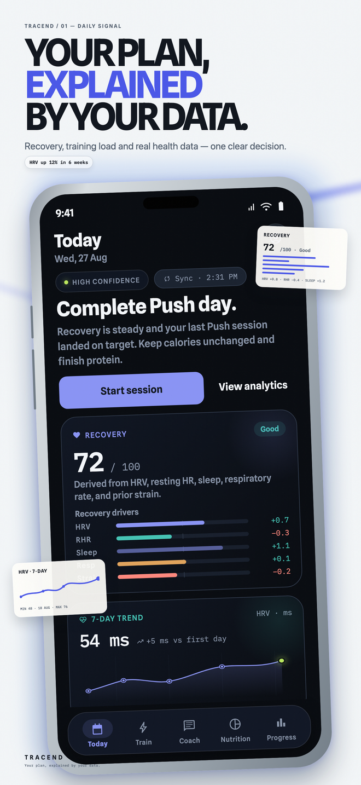
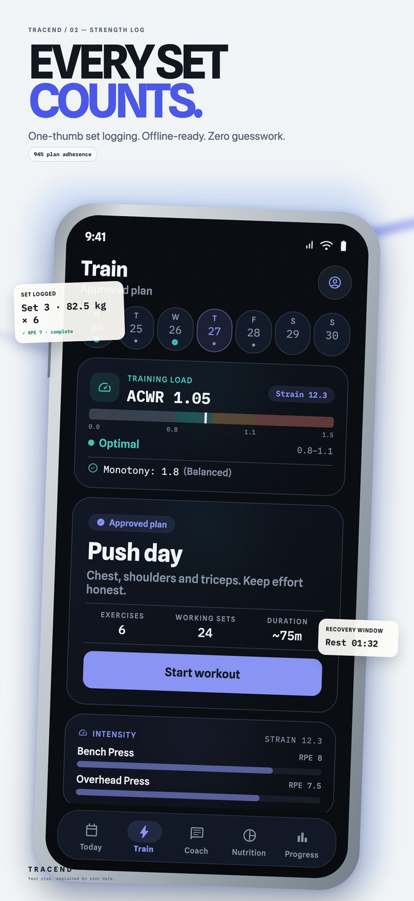
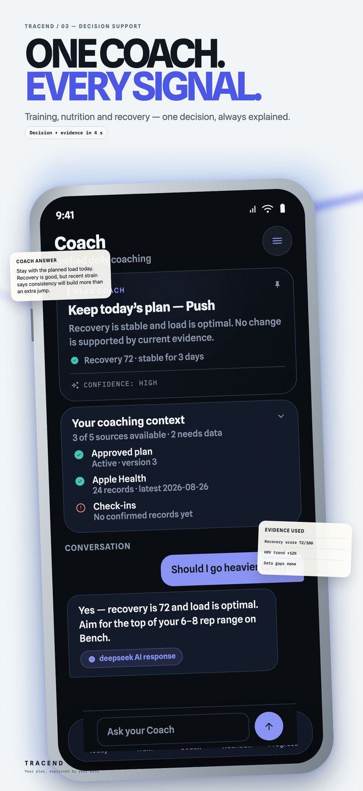
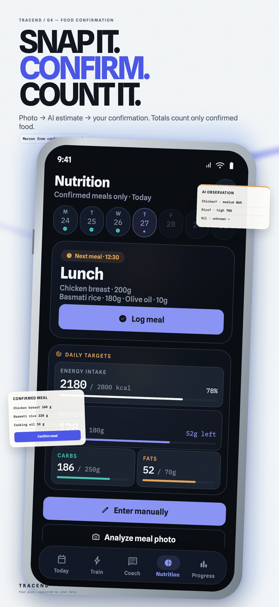
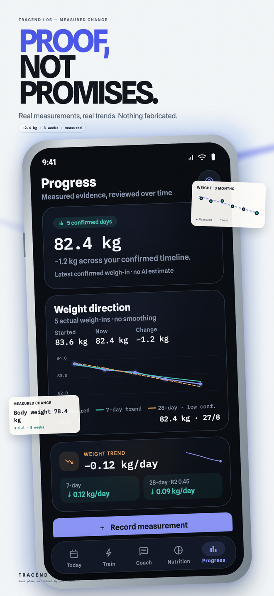
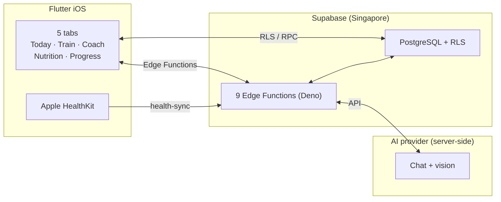

<p align="center">
  
</p>

<h1 align="center">Tracend</h1>

<p align="center">
  <strong>Evidence-driven AI personal trainer</strong><br/>
  <em>Your body. Your data. Your next move.</em>
</p>

<p align="center">
  <a href="https://github.com/PurnaJear06/Tracend/actions/workflows/ci.yml"></a>
  <a href="https://github.com/PurnaJear06/Tracend/actions/workflows/deploy.yml"></a>
  <a href="LICENSE"></a>
  <br/>
  
  
  
  
  
</p>

<p align="center">
  <a href="#features">Features</a> &middot;
  <a href="#ai-stack">AI Stack</a> &middot;
  <a href="#architecture">Architecture</a> &middot;
  <a href="#quick-start">Quick Start</a> &middot;
  <a href="#documentation">Docs</a> &middot;
  <a href="#stack">Stack</a> &middot;
  <a href="#license">License</a>
</p>

<p align="center">
  Private beta &middot; iOS 17+ &middot; Apple HealthKit &middot; every model decision requires your approval
</p>

---



Tracend gives a healthy adult a personalized training and nutrition plan, observes real
execution and recovery, and produces clear daily coaching decisions — like a careful
personal trainer. Plans stay stable until evidence supports a change, and every persistent
change requires your approval.

The **Today** dashboard turns sleep, activity, and vitals from Apple Health into three
tappable factors — **Recovery**, **Training**, and **Nutrition** — explained in plain
language with progressive disclosure, instead of a wall of numbers.

Four rules hold the whole system together:

- **Deterministic code does the math.** Trends, adherence, and baselines are calculated —
  never generated. The model interprets; it never computes.
- **Model output never acts on its own.** No plan activation, no confirmed meal, no durable
  user fact without your explicit approval.
- **Persistent change follows an audit trail.** Evidence → validation → approval → new
  version → audit event.
- **The plan survives failure.** When AI, HealthKit, or media processing is down, your
  active plan keeps working.

<br clear="all"/>

---

## Features



### 🏋️ Train — every set counts

A plan built around your actual capacity, adjusted by evidence — not vibes.

- Set-level session tracking: reps, RPE, and pain per set
- In-progress sessions survive an app restart and resume where you left off
- HealthKit auto-detects completed workouts and reconciles them with your scheduled plan

<br clear="all"/>



### 🤖 Coach — every signal connected

Coaching chat that remembers your history across sessions.

- Five-layer continuity memory: narrative entries, user preferences, session summaries,
  message search, and context assembly
- Every recommendation cites its evidence source — reasoning chains shown inline, never
  hidden

<br clear="all"/>



### 🥗 Nutrition — confirm before it counts

Log meals by text or photo. Vision identifies the food and estimates macros — you confirm
before anything is persisted.

- Per-meal-slot schedule compliance with 7-day adherence visibility
- Confirmed meals stay visible after midnight; corrections become audited amendments

<br clear="all"/>



### 📈 Progress — proof, not promises

Raw charts with no smoothing masquerading as current data.

- Weight, measurements, and body metrics on a single date-ordered effective timeline
- Same-day corrections become audited amendments — never silent overwrites

<br clear="all"/>

## AI Stack

| Layer                 | Technology                     | Purpose                                                                                 |
| :-------------------- | :----------------------------- | :-------------------------------------------------------------------------------------- |
| **Coach chat**        | AI, routed server-side         | Evidence-backed coaching responses with reasoning chains                                |
| **Meal vision**       | AI vision, routed server-side  | Macro estimation and food identification from photos                                      |
| **Context assembly**  | PostgreSQL + PL/pgSQL          | Five-layer structured memory assembled before inference                                  |
| **Output validation** | Deterministic policy engine    | Schema, semantics, evidence citations, and policy permissions — reject on ANY failure     |
| **Safety**            | `beforeSend` scrubber          | Redacts sensitive data before crash reporting reaches Sentry                              |

> Providers are routed and configured server-side — the app never names, embeds, or depends
> on a specific one. The single source of truth for model boundaries and provider rules is
> [`docs/AI_SAFETY_SPEC.md`](docs/AI_SAFETY_SPEC.md).

## Architecture


```mermaid
flowchart LR
  subgraph Client["Flutter iOS"]
    UI["5 tabs<br/>Today · Train · Coach<br/>Nutrition · Progress"]
    HK["Apple HealthKit"]
  end
  subgraph Supabase["Supabase (Singapore)"]
    DB["PostgreSQL + RLS"]
    EF["9 Edge Functions (Deno)"]
  end
  subgraph AI["AI provider (server-side)"]
    FL["Chat + vision"]
  end
  UI <-->|RLS / RPC| DB
  UI <-->|Edge Functions| EF
  HK -->|health-sync| EF
  EF <-->|API| FL
  EF <--> DB
```

**9 Edge Functions:** `coach-chat` · `coach-decide` · `health-check` · `health-sync` ·
`meal-analyze` · `meal-media-retention` · `onboarding-propose-plan` · `privacy-delete-account` ·
`privacy-export`

## Quick Start

```sh
git clone https://github.com/PurnaJear06/Tracend.git
cd Tracend

# 1. Install toolchain (one-time)
./scripts/bootstrap-flutter.sh
./scripts/bootstrap-tools.sh

# 2. Run checks
./scripts/flutter.sh analyze         # Dart static analysis
./scripts/flutter.sh test            # Flutter unit + widget tests
./scripts/deno.sh task check         # Deno fmt + lint + test

# 3. Full pre-deploy gate (all layers — matches CI)
./scripts/pre-deploy.sh
```

> All tooling state stays under `.tooling/` on the external SSD. Never invoke `flutter`,
> `deno`, `supabase`, or `docker` directly — use the `./scripts/` wrappers. See [`AGENTS.md`](AGENTS.md)
> for the full toolchain reference.

## Documentation

| Document                                                           | Purpose                                                     |
| :----------------------------------------------------------------- | :---------------------------------------------------------- |
| [`AGENTS.md`](AGENTS.md)                                           | Agent instructions, toolchain reference, architecture rules |
| [`docs/PRD.md`](docs/PRD.md)                                       | Product scope, audience, feature requirements               |
| [`docs/ARCHITECTURE.md`](docs/ARCHITECTURE.md)                     | System design, data flow, component boundaries              |
| [`docs/UX_FLOWS.md`](docs/UX_FLOWS.md)                             | Screen navigation, interaction states, journeys             |
| [`docs/DESIGN_SYSTEM.md`](docs/DESIGN_SYSTEM.md)                   | Visual tokens, component specs, theming rules               |
| [`docs/DATA_MODEL.md`](docs/DATA_MODEL.md)                         | Entity definitions, field schemas, lifecycle rules          |
| [`docs/AI_SAFETY_SPEC.md`](docs/AI_SAFETY_SPEC.md)                 | Model boundaries, provider rules, output validation         |
| [`docs/SECURITY_PRIVACY.md`](docs/SECURITY_PRIVACY.md)             | Data collection, retention, deletion, access control        |
| [`docs/TESTING_STRATEGY.md`](docs/TESTING_STRATEGY.md)             | Test layers, coverage expectations, quality gates           |
| [`docs/IMPLEMENTATION_ROADMAP.md`](docs/IMPLEMENTATION_ROADMAP.md) | Phase sequencing, milestones, delivery plan                 |
| [`docs/CONTEXT_BUDGET.md`](docs/CONTEXT_BUDGET.md)                 | AI context budget rules and contract testing                |
| [`docs/adr/`](docs/adr/)                                           | Architecture Decision Records                               |

## Stack

**Client** — Flutter 3.41.7 · Dart 3.11.5 · iOS 17+ · HealthKit · Sentry crash reporting

**Backend** — Supabase · PostgreSQL + RLS · 9 Deno Edge Functions · Session pooler · Storage

**AI** — Server-side provider routing · Five-layer continuity memory · Deterministic output
validation · All model keys server-side only

**Infra** — GitHub Actions CI · Automated deploy pipeline · Pre-deploy gate · Automated
database backups · Edge Function rollback scripts · Gitleaks pre-commit · Dependabot

## License

Released under the [MIT License](LICENSE).

---

<p align="center">
  <em>Tracend is a working brand pending trademark and App Store name clearance.</em>
</p>
